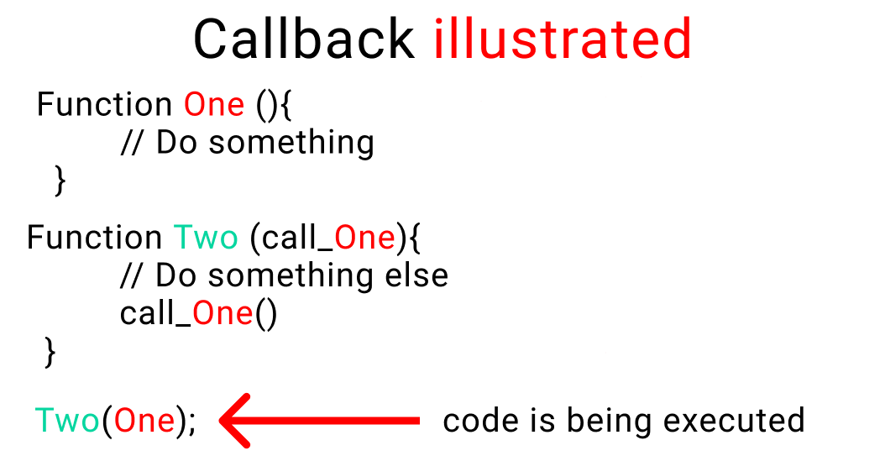
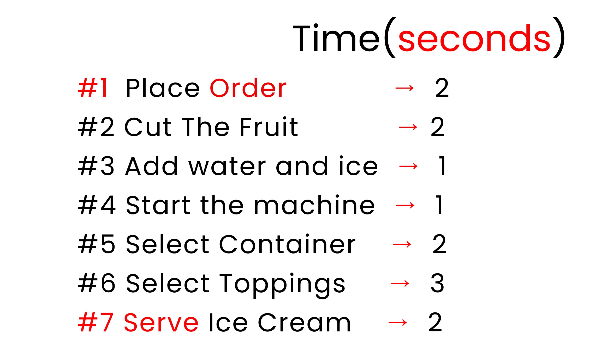
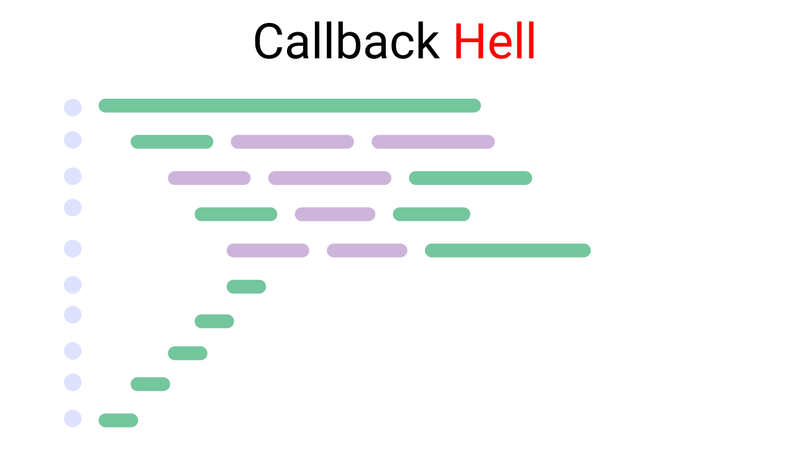

# Callbacks, Promises, and Async/Await

- The theory of async JavaScript helps you break down big complex projects into smaller tasks.

- Then you can use any of these three techniques – callbacks, promises or Async/await – to run those small tasks in a way that you get the best results.

## Synchronous vs Asynchronous JavaScript

- In a synchronous system, tasks are completed one after another.
- In this system, tasks are completed independently.
- Here, imagine that for 10 tasks, you have 10 hands. So, each hand can do each task independently and at the same time.

### Synchronous Asynchronous Example

- Look at asynSyn.js

## Callbacks in JavaScript

- When you nest a function inside another function as an argument, that's called a callback.



- When doing a complex task, we break that task down into smaller steps. To help us establish a relationship between these steps according to time (optional) and order, we use callbacks.

### Exmaple:

- To make an ice cream using callback. The shop will have two parts to make an ice cream:

1. The storeroom will have all the ingredients [Our Backend]
2. We'll produce ice cream in our kitchen [The frontend]



- Look at callback.js

- In the example callback.js this is called callback hell. It looks something like this: 👇



- Callback hell, also known as the pyramid of doom, refers to a situation in asynchronous programming where multiple nested callbacks are used, leading to code that is difficult to read, maintain, and reason about. It occurs when there are many asynchronous operations that depend on the results of each other, resulting in deeply nested callback functions.

- What's the solution to this?

## Use Promises to Escape Callback Hell


1. Pending: This is the initial stage. Nothing happens here. Think of it like this, your customer is taking their time giving you an order. But they haven't ordered anything yet.
2. Resolved: This means that your customer has received their food and is happy.
3. Rejected: This means that your customer didn't receive their order and left the restaurant.

Four things to understand:

- Relationship between time and work
- Promise chaining
- Error handling
- The .finally handler

### Example:

look at promises.js file

## Async / await

- A better way to write promises with more simple and clean code
- All you have to do is write the word async before any regular function and it becomes a promise.

### Promises vs Async/Await

while using promise, we write as follows

```
const order () => {
    return new Promise((reolve, reject) => {
        // write code here
    });
}
```

And using async

```
const order = async() => {
    // write your code
}
```

We need to understand with async

1. How to use the try and catch keywords
2. How to use the await keyword

### Promises in JS -> resolve or reject

- We use the try keyword to run our code while we use catch to catch our errors. It's the same concept we saw when we looked at promises.

1. try and catch with promises

```
const kitchen = () => {
    return new Promise((resolve, reject) => {
        if(true) {
            resolve("promise fullfiled")
        }
        else {
            reject("promise rejected")
        }
    })
}

kitchen()  // run the code
.then()    // next step
.then()    // next step
.catch()   // error caught here
.finally() // end of the promise [optional]
```

### Async / Await in JS -> try, catch

```
const kitchen = async() => {
    try {
        // Let's create a fake problem
        await abc;
    }
    catch(error) {
        console.log("abc function doesn't exist", error);
    }
    finally {
        console.log("this code always run")
    }
}

kitchen()
```

### JavaScript's Await Keyword

Let's go back to our ice cream shop. We don't know which topping a customer might prefer, chocolate or peanuts. So we need to stop our machine and go and ask our customer what they'd like on their ice cream.

Notice here that only our kitchen is stopped, but our staff outside the kitchen will still do things like:

- doing the dishes
- cleaning the tables
- taking orders, and so on.

Example: Look at 5-async_await.js

## Small note

- When using Async/ Await, you can also use the .then, .catch, and .finally handlers as well which are a core part of promises. Look at 6-async_await.js

> Note: [Source](https://www.freecodecamp.org/news/javascript-async-await-tutorial-learn-callbacks-promises-async-await-by-making-icecream/)
