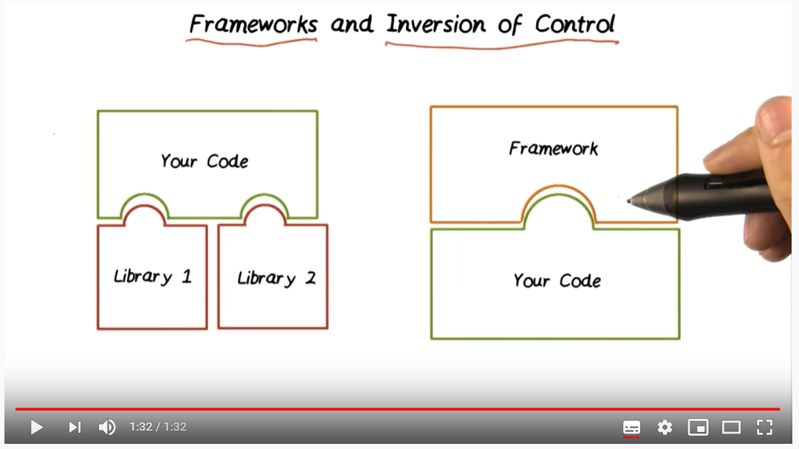

# JavaScript Libraries/Frameworks
- It is a open source library developed by facebook in 2013.
- It came up with a Virtual DOM better than other JS frameworks such as Angular.

## Objectives and Outcomes

1. Get a basic overview of JavaScript frameworks and libraries
2. Understand the architecture of an React application
3. Scaffold out a starter React application using create-react-app, the command line tool

## Why JavaScript Libraries/Frameworks?
- Complexity of managing DOM manipulation and data updates manually
- Well defined application architectures:
    1. Model View Controller / Model View View Model / Model View Whatever
    2. Binding of model and view: controllers, view models
    3. Flux architecture / Redux

## Library vs Framework
- a library - a collection of functions which are useful when
writing web apps. Your code is in charge and it calls into the
library when it sees fit. E.g., jQuery.
- frameworks - a particular implementation of a web application,
where your code fills in the details. The framework is in charge
and it calls into your code when it needs something app specific.
E.g., Angular, Ember, etc.
- Imperative (shows how to do it) and declarative (shows what you want to do such as printing to screen) programming
- framework is Hollywood Principle – Don’t call us, we’ll call you!
- framework is inversion of control and priciple of hollywood. In libraries most of the work is done using your code and you may add some libraries. But opposite in case of framework ([video source](https://www.youtube.com/watch?v=vFzP2SaMyA0)).

