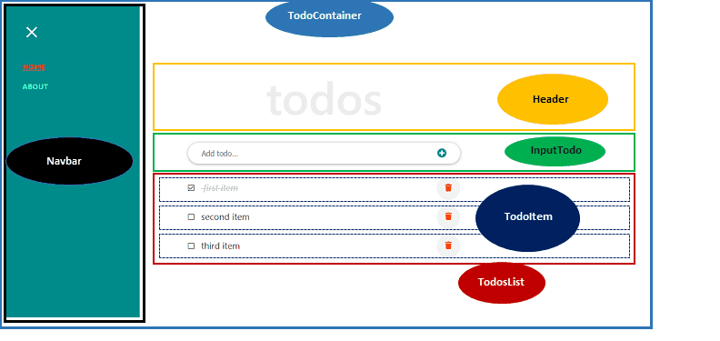

# React
- A JavaScript library for building user interfaces
- Declarative: 
    - React also states that it uses a declarative approach.
    - Now that leaves you in a confused state because we saw that frameworks generally tend to use the declarative approach. But in React, the declarative approach used by React as specified on its website

- Component-based: It encapsulate behaviors into small units called Components.

- Technology stack agnostic: React makes no assumptions about the entire technology stack that you're going to use for implementing your Web applications. React plays well with any technology stack that you can use behind the seats. React itself concentrates only on the user interface side of the story, and that leaves it up to the application designer to decide how they want to implement the architecture and how they want your application to interact with the back-end server. We will go through technology stack which includes the Flux architecture approach,
and in specifically the use of Redux for implementing a state based storage for our Web application and also the use of Fetch for interacting with our back-end server. 

## Installation: Getting Started with React
1. instal npm or yarn
2. we can install react globally => yarn global add create-react-app@1.5.2 or inside our git repo => npx create-react-app .
- create-react-app --help
3. if installed globally then => create-react-app app_name
4. yarn start
5. init the project as git

```
git init
git add .
git commit -m "Initial Setup"
```

## React Application Overview
### React Element
- Smallest building blocks of React apps: refer to as a React Element.
In this React Element,
you're noticing this h1 tag here, all these elements are plain JavaScript objects, that are very cheap to create and so you can create a lot
of them for use within your React Application. 

```
const element = <h1 className="App-title">Welcome to React</h1>;
```

- Plain JS objects that are Cheap to create
- Components are “made of” elements

### Rendering to the DOM
- Rendered using ReactDOM. See index.js
```
ReactDOM.render(<App />, document.getElementById('root’));
```
- Where is it rendered? See index.html
```
<div id="root"></div>
//Root DOM node
```
## Why is JSX important?
- JSX (along with React) was introduced by Facebook in 2013. It's a syntax extension of JavaScript that allows you to write HTML and CSS inside JavaScript.
- t's a fundamental part of the React ecosystem that will speed up and improve your development experience!

> Note: Some years ago, web development best practices taught us that HTML, CSS, and JavaScript should be separated, every one in its own file and doing different things, with a unique scope and responsibility. Well, things have changed in the last years. Modern JavaScript tools, like webpack and Babel, now allow you to write HTML, CSS, and JavaScript together! But don't worry, your code will be transpiled into regular, standard HTML, CSS, and JavaScript again, ready to be distributed and understood by browsers.

### JSX expression:

```
const myHtml = (
  <div>
    <h1>My title</h1>
    <div className="container">
      <p>I'm a paragraph, <span>and I'm a span</span></p>
    </div>
  </div>
);
```

Our JSX expression will be converted, behind the scenes, by React, webpack, and Babel, to this:

```
"use strict";

const myHtml = React.createElement(
  "div",
  null,
  React.createElement("h1", null, "My title"),
  React.createElement(
    "div",
    {
      className: "container",
    },
    React.createElement(
      "p",
      null,
      "I'm a paragraph, ",
      React.createElement("span", null, "and I'm a span")
    )
  )
);
```

## Configure your React Project to use Reactstrap
In this exercise we will set up our project to use Reactstrap (a package supporting easy to use React based Bootstrap 4 components).

1. Configure your React Project to use Reactstrap
```
yarn add bootstrap@4.0.0
yarn add reactstrap@5.0.0
yarn add react-popper@0.9.2
```
> Note: You can also install the same using npm using the "npm install `<package>` --save" option if you are using npm instead of yarn.

## Components
- Components are at the heart of React. 
- They are pieces of code with a specific purpose, that you can reuse and compose to build bigger, complex applications (yes, just like functions!). The idea is to make code reusable.
- Conceptually, components are like JavaScript functions. They accept arbitrary inputs (called “props”) and return React elements describing what should appear on the screen.



### Types of components
1. Class components use the ES6 class syntax, adding some specific React features: state, props, lifecycle methods, and a render() method.

2. Functional components are just functions that return JSX. Before the introduction of React hooks (moethods) in 2019, they were called stateless, presentational or dumb components, because they accepted only props, but couldn't have state and were used only to display props. But with the introduction of React hooks, now functional components can have state and props, and manage their lifecycle.

It doesn't mean class components are deprecated - they are still fully supported, and there are no plans of deprecating them. 


> Note: Look at componenet.js from react-practice-code. More details about [component](https://reactjs.org/docs/components-and-props.html)

> Note: Extracting components might seem like grunt work at first, but having a palette of reusable components pays off in larger apps. A good rule of thumb is that if a part of your UI is used several times (Button, Panel, Avatar), or is complex enough on its own (App, FeedStory, Comment), it is a good candidate to be extracted to a separate component. Example: react-practice-code then compoenents/comment.js, userInfo.js and date.js

> Note: All React components must act like pure functions with respect to their props.
Of course, application UIs are dynamic and change over time. In the next section, we will introduce a new concept of “state”. State allows React components to change their output over time in response to user actions, network responses, and anything else, without violating this rule.

### The Concept of Virtual DOM
- The DOM (Document Object Model) is an interface that allows JavaScript or other scripts to read and manipulate the content of a document (in this case, an HTML document).
- Whenever an HTML document is loaded in the browser as a web page, a corresponding Document Object Model is created for that page. This is simply an object-based representation of the HTML.
- But hey! There is a problem. Though not with the DOM. Every time the DOM changes, the browser would need to recalculate the CSS, run layout and repaint the web page.
- And with Single Page Application (SPA) whereby JavaScript updates the DOM much more than they have to. Things become slower due to the process in the browser workflow after DOM manipulation.
- As the name implies, it is a virtual representation of the actual DOM. It uses a strategy that updates the DOM without having to redraw all the webpage elements. This ensures that the actual DOM receive only the necessary data to repaint the UI.
- Let's see how it works. Whenever a new element is added to the UI, a virtual DOM is created. Now, if the state of this element changes, React would recreate the virtual DOM for the second time and compare with the previous version to detect which of the virtual DOM object has changed. It then updates ONLY the object on the real DOM. This has a whole lot of optimization as it reduces the performance cost of re-rendering the webpage.

### Enabling the Strict Mode in React Application
- During the development stage of your application, you’d want to get notified about any potential problems associated with your app so you can quickly address the issue(s).

- React provides for us the StrictMode to activate checks and logs a warning message at runtime.

- To enable it, we simply wrap our component with <React.StrictMode>

## Props & state

### Why are React state and props important?

- React components can have state and props.
- State and props are the two ways React can update a component or share data between components. 
- They are the key to compose a complex application using several components. When props or state changes, React will re-render the parts of your application that use this data, keeping it up-to-date.

### Props
- React is a component-based library and it expects you to break the UI into a component hierarchy. 
- In other words, you may have a root component, and it will have children. 
- You can pass data from parent to children using props (like passing arguments to a function).

#### Example, a very simple component receiving a name prop:
```
// Define the component
const Greeter = ({name}) => <p>{`Hi ${name}!`}</p>
// Use the component passing a name prop
<Greeter name="John" />
<Greeter name="Juan" />
```

In this component, name is received from a parent, Greeter component just displays it.

### State
- A React component needs some data, this data has some life, it will be used for a period of time, and may change in response to some action. 
- It may change due to user interaction (click, select, typing, drag and drop, etc.), or programmatically (a timer finishes, a request to a server is resolved, etc.). This kind of data is called the state of the component.

#### Example, a very simple component with state:
```
class Cat extends React.Component {
  constructor(props) {
    super(props);
    this.state = {sleeping: true};
  }
  render() {
    return (
      <div>
        <p>{`The cat is ${this.state.sleeping ? "sleeping" : "eating"}`}</p>
        <button onClick={() => this.setState({ sleeping: false })}>
          Wake up!
        </button>
      </div>
    );
  }
}
```
In this example, the Cat component has a sleeping state. Note that it can change when clicking on the button.

### Props vs state
- A component may use only props, only state, or both state and props. You should decide what is better in every circumstance:
- Typically, you will use props when you need to pass down data, from parent to children. And you will use state when this data belongs, in other words it is controlled and modified by the component.
- When passing props to a component, it may be used without modifications, for example, to display something. But sometimes you may need to change that data in some way, then you can use that prop and make it part of your state. Then if you need it, you can pass it down to another child component as a prop.

#### Example, combining props and state:
```
const Cat = ({timeToEat}) => (
  <p>{`I'm ${timeToEat ? 'happy' : 'sad'}`}</p>
)

class Cats extends React.Component {
  constructor(props) {
    super(props);
    this.state = {timeToEat: false};
  }
  render() {
    return (
      <div>
        <Cat timeToEat={this.state.timeToEat} />
        <button onClick={() => this.setState({ timeToEat: true })}>
          Time to eat!
        </button>
      </div>
    );
  }
}
```
In this example, the Cats component is initialized with timeToEat: false. This state can change at any moment. Then, timeToEat is passed as a prop to the child component Cat.

## State and Life Cycle

> Note: Always recommended to read [this](https://reactjs.org/docs/state-and-lifecycle.html) for state and life cycle of state from official docs. All the coding challenges are also solved in components/state.js from react-practice-code.


## Hooks in React
