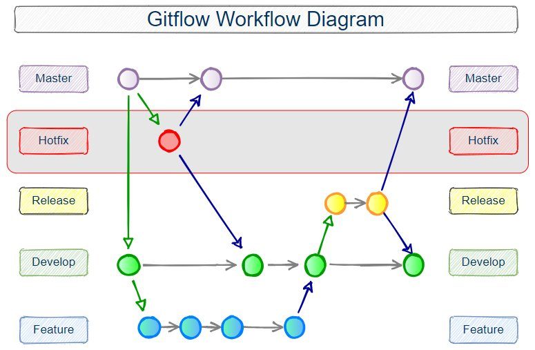

# Gitflow
The primary purpose of Gitflow is the same as in the case of the GitHub flow. However, there one important difference - in Gitflow, you keep two special branches: one for development code shared with your team and one that is used only for production code.

Gitflow is one of many styles of Git workflows you and your team can utilize.

Some key takeaways to know about Gitflow are:

- The workflow is great for a release-based software workflow.
- Gitflow offers a dedicated channel for hotfixes to production.

> Note: [This](https://www.youtube.com/watch?v=gW6dFpTMk8s) ten miniutes video will explain the whole worflow of gitflow. and [this five minutes](https://www.youtube.com/watch?v=1SXpE08hvGs)

## Why is it important?
As in the case of GitHub flow - everybody in your team uses the same flow and there are branches created which are then merged with the main branch. In gitflow, many development teams can work together and merge their works to the development branch.

## The overall flow of Gitflow is: 

1. A develop branch is created from main
2. A release branch is created from develop
3. Feature branches are created from develop
4. When a feature is complete it is merged into the develop branch
5. When the release branch is done it is merged into develop and main
6. If an issue in main is detected a hotfix branch is created from main
7. Once the hotfix is complete it is merged to both develop and main

## Git Flow vs Github Flow
The principals ways to manage a software in GIT are: the Git Flow and the Github Flow.

### Gitflow

The main branches in this flow are:

1. master
2. develop: Once repo created, then immediatelly create develop branch which will be the main branch for development. Make sure to change the default branch from repo setting to created develop branch from main.
3. features: The branch where all developers create to work.
4. hotfix: created directly from main (master) branch to for the maintenance purpose to fix bugs, small changes and errors. it will be merged to main and develop branch.
5. release: It will be created from develop branch and once develop branch with many feature branches are ready for deplyment then it will be put inside release branch as a version (example 0.1). Here bugs and errors will be fixed. The code to the release branch where there you’ll start to test properly before the final deployment.
When you branch your code from develop to release you should avoid to add new features but you should only fix bugs inside the release branch code until to you create a stable release branch. The changes will be merged with main and develop branch.

### Gitflow Workflow setup:
Source of below setup: [Practical Gitflow workflow](https://www.theserverside.com/blog/Coffee-Talk-Java-News-Stories-and-Opinions/init-Gitflow-example-workflow-tutorial)

1. Create a repo and clone it.
2. run git flow init
3. git branch -a (Notice there are only two branches after a “git flow init” command)
4. This creates a new feature branch named “feature_branch” => git flow feature start feature_branch
>Note: A new branch “feature/feature_branch” was created, based on “development.” You are now on branch “feature/feature_branch.” Notice that there are three branches now => git branch -a
5. Now, start committing, creating new files and add codes on your feature.
6. Finish work on the feature branch. This merges and deletes it => git flow feature finish feature_branch.
> Note: The feature branch “feature/feature_branch” was merged into “development.” and has been locally deleted. You are now on branch “development.”
7. git branch -a (feature_branch is gone now)
8. There are no tags on the repo yet. To check => git tag -l
9. git flow release start '0.1.0'
> Note: A new branch “release/0.1.0” was created, based on “development.”. You are now on branch “release/0.1.0”.
10. Start committing last-minute fixes (bugs, errors) in preparing your release. When done => git flow release finish '0.1.0'
> Note: Release branch “release/0.1.0” has been merged into “main.” and “development.” and locally deleted. The release was tagged “0.1. 0”. And the merge to master added a Git tag. (You are now on branch “development.”) => git branch -a
11. For hotfix branch => git flow hotfix start hotfix_branch
12. You are now on hotfix_branch. Fix if any bugs or errors or small changes reqired.
13. git flow hotfix finish hotfix_branch
> Note: Similar to finishing a release branch, a hotfix branch gets merged into both main and develop.

> Note: We can manage all the above git flow process without using gitflow as well by creating all the branches manually and making the setup in github. For better understanding on how to do this. Visit the [link](https://www.atlassian.com/git/tutorials/comparing-workflows/gitflow-workflow) and Watch the [video](https://www.youtube.com/watch?v=d0WEe8xH5mk).

